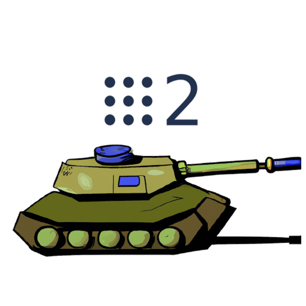

# YAHBOOM G1 Tank ROS2

<!-- Improved compatibility of back to top link: See: https://github.com/othneildrew/Best-README-Template/pull/73 -->
<a name="readme-top"></a>

<!-- PROJECT SHIELDS -->
<!--
*** I'm using markdown "reference style" links for readability.
*** Reference links are enclosed in brackets [ ] instead of parentheses ( ).
*** See the bottom of this document for the declaration of the reference variables
*** for contributors-url, forks-url, etc. This is an optional, concise syntax you may use.
*** https://www.markdownguide.org/basic-syntax/#reference-style-links
-->
[![Contributors][contributors-shield]][contributors-url]
[![Forks][forks-shield]][forks-url]
[![Stargazers][stars-shield]][stars-url]
[![Issues][issues-shield]][issues-url]
[![MIT License][license-shield]][license-url]
[![LinkedIn][linkedin-shield]][linkedin-url]


<!-- PROJECT LOGO -->
<br />
<div align="center">
  <a href="https://github.com/jhiggason/YahBoomG1Tank">
    
  </a>

<h3 align="center">YAHBOOM G1 Tank ROS2</h3>

  <p align="center">
This project aims to develop a functional ROS2 node using Python, designed for the **YAHBOOM G1 Tank** with **Raspberry Pi 4** as its foundation. 

In the initial stages, we'll be utilizing the teleop executable from `turtlesim` as a pre-setup input device to supply the twist messages. These twist messages, essentially, dictate the movement commands (linear and angular velocities) for the robot. This mechanism provides a foundational control method. As the project progresses, we'll explore more advanced and perhaps autonomous control methodologies.

Beyond just a learning exercise in ROS2, our aspiration is to contribute something valuable to the broader community. This endeavor also encompasses vehicles employing the "Yahboom 4WD expansion board for robot car, SKU: 6000300085" and related vehicles. 
    <br />
    <a href="https://github.com/jhiggason/YahBoomG1Tank#getting-started"><strong>Explore the docs »</strong></a>
    <br />
    <br />
    <a href="https://github.com/jhiggason/YahBoomG1Tank">View Demo</a>
    ·
    <a href="https://github.com/jhiggason/YahBoomG1Tank/issues">Report Bug</a>
    ·
    <a href="https://github.com/jhiggason/YahBoomG1Tank/issues">Request Feature</a>
  </p>
</div>


<!-- TABLE OF CONTENTS -->
<details>
  <summary>Table of Contents</summary>
  <ol>
    <li>
      <a href="#about-the-project">About The Project</a>
      <ul>
        <li><a href="#built-with">Built With</a></li>
      </ul>
    </li>
    <li>
      <a href="#getting-started">Getting Started</a>
      <ul>
        <li><a href="#prerequisites">Prerequisites</a></li>
        <li><a href="#installation">Installation</a></li>
      </ul>
    </li>
    <li><a href="#usage">Usage</a></li>
    <li><a href="#roadmap">Roadmap</a></li>
    <li><a href="#contributing">Contributing</a></li>
    <li><a href="#license">License</a></li>
    <li><a href="#contact">Contact</a></li>
    <li><a href="#acknowledgments">Acknowledgments</a></li>
  </ol>
</details>


<!-- ABOUT THE PROJECT -->
## About The Project
<p align="center">
 
</p>

<p align="right">(<a href="#readme-top">back to top</a>)</p>

### Built With

* [![Python3][Python.org]][Python-url]
* [![ROS2][ROS.org]][ROS-url]

<p align="right">(<a href="#readme-top">back to top</a>)</p>


<!-- GETTING STARTED -->
## Getting Started

This guide will help you set up and run the ROS2 Python node for the YAHBOOM G1 Tank with Raspberry Pi 4.

### Prerequisites

#### Hardware:
- **YAHBOOM G1 Tank**: Ensure it's fully assembled and tested for basic operations.
- **Raspberry Pi 4**: Properly interfaced with the G1 Tank.

#### Software:
- **Ubuntu 22 for Raspberry Pi**: Installed and set up on your Raspberry Pi 4.
- **ROS2 Humble-desktop**: Installed following the official [installation guide](https://index.ros.org/doc/ros2/Installation/Humble/).
- **Colcon**: Required for building and testing ROS packages. Install with:
  ```bash
  sudo apt install python3-colcon-common-extensions
  ```
- **RPI-GPIO**: Library to control Raspberry Pi GPIO channels. Install using:
  ```bash
  sudo apt install python3-rpi.gpio
  ```

### Installation and Setup

1. **Setting Permissions**:
   If you encounter a "RuntimeError: No access to /dev/mem", adjust permissions for GPIO access on your Raspberry Pi:
   ```bash
   sudo chmod 777 /dev/mem
   sudo chmod 777 /dev/gpiomem
   ```
   After adjusting, reboot your Raspberry Pi.

2. **Clone the Repository**:
   Navigate to your home directory, then run:
   ```bash
   mkdir ~/ros2_ws/
   cd ~/ros2_ws
   git clone https://github.com/jhiggason/yahboomg1tank.git .
   ```

3. **Build the ROS2 Package**:
   Compile the project using `colcon`:
   ```bash
   colcon build
   ```

4. **Source the Workspace**:
   After building, source the workspace:
   ```bash
   source ~/ros2_ws/install/setup.bash
   ```

5. **Running the Node**:
   To activate and run your ROS2 node, execute:
   ```bash
   ros2 run tank_control_pkg tank_control
   ```

### First Use:
Upon successfully setting up and running the node, the YAHBOOM G1 Tank should now respond to the twist messages provided by the `turtlesim` teleop or any other control method you've implemented.

---

For any issues or to contribute, engage with this GitHub repository.

<p align="right">(<a href="#readme-top">back to top</a>)</p>

<!-- USAGE EXAMPLES -->
## Usage

The TankControl class is a subclass of rclpy.node.Node, which means it is a ROS2 node that can subscribe to topics and publish messages. The __init__ method sets up the GPIO pins for the left and right motors, initializes the PWM for the motors, and subscribes to the /turtle1/cmd_vel topic with the correct message type.

The listener_callback method is called whenever a message is received on the /turtle1/cmd_vel topic. It extracts the linear and angular velocities from the message and calls the drive method to control the motors accordingly. The drive method sets the direction and speed of the motors using the GPIO pins and PWM, and the stop_motors method stops the motors and cleans up the GPIO pins when the node is shut down.

_For more examples, please refer to the [Documentation](https://github.com/jhiggason/YahBoomG1Tank#getting-started)_

<p align="right">(<a href="#readme-top">back to top</a>)</p>


<!-- ROADMAP -->
## Roadmap

- [X] Working ROS2 that talks on the correct raspberry pi pins
- [ ] Feature 2
- [ ] Feature 3
    - [ ] Nested Feature

See the [open issues](https://github.com/jhiggason/YahBoomG1Tank/issues) for a full list of proposed features (and known issues).

<p align="right">(<a href="#readme-top">back to top</a>)</p>


<!-- CONTRIBUTING -->
## Contributing

Contributions are what make the open source community such an amazing place to learn, inspire, and create. Any contributions you make are **greatly appreciated**.

If you have a suggestion that would make this better, please fork the repo and create a pull request. You can also simply open an issue with the tag "enhancement".
Don't forget to give the project a star! Thanks again!

1. Fork the Project
2. Create your Feature Branch (`git checkout -b feature/AmazingFeature`)
3. Commit your Changes (`git commit -m 'Add some AmazingFeature'`)
4. Push to the Branch (`git push origin feature/AmazingFeature`)
5. Open a Pull Request

<p align="right">(<a href="#readme-top">back to top</a>)</p>


<!-- LICENSE -->
## License

Distributed under the MIT License. See [LICENSE](https://github.com/jhiggason/YahBoomG1Tank/blob/main/LICENSE) for more information.

<p align="right">(<a href="#readme-top">back to top</a>)</p>


<!-- CONTACT -->
## Contact

Your Name - Jeff Higgason - jeffh@opensar.net

Project Link: [https://github.com/jhiggason/YahBoomG1Tank](https://github.com/jhiggason/YahBoomG1Tank)

<p align="right">(<a href="#readme-top">back to top</a>)</p>


<!-- MARKDOWN LINKS & IMAGES -->
<!-- https://www.markdownguide.org/basic-syntax/#reference-style-links -->
[contributors-shield]: https://img.shields.io/github/contributors/jhiggason/YahBoomG1Tank.svg?style=for-the-badge
[contributors-url]: https://github.com/jhiggason/YahBoomG1Tank/graphs/contributors
[forks-shield]: https://img.shields.io/github/forks/jhiggason/YahBoomG1Tank.svg?style=for-the-badge
[forks-url]: https://github.com/jhiggason/YahBoomG1Tank/network/members
[stars-shield]: https://img.shields.io/github/stars/jhiggason/YahBoomG1Tank.svg?style=for-the-badge
[stars-url]: https://github.com/jhiggason/YahBoomG1Tank/stargazers
[issues-shield]: https://img.shields.io/github/issues/jhiggason/YahBoomG1Tank.svg?style=for-the-badge
[issues-url]: https://github.com/jhiggason/YahBoomG1Tank/issues
[license-shield]: https://img.shields.io/github/license/jhiggason/YahBoomG1Tank.svg?style=for-the-badge
[license-url]: https://github.com/jhiggason/YahBoomG1Tank/blob/master/LICENSE
[linkedin-shield]: https://img.shields.io/badge/-LinkedIn-black.svg?style=for-the-badge&logo=linkedin&colorB=555
[linkedin-url]: https://www.linkedin.com/in/jeff-higgason-2a20a9227/
[Python.org]: https://img.shields.io/badge/Python-3776AB?style=for-the-badge&logo=python&logoColor=white
[Python-url]: https://www.python.org/
[ROS.org]: https://img.shields.io/badge/ROS2-Humble-%2322314E?style=for-the-badge&logo=ros&logoColor=%2322314E
[ROS-url]: https://docs.ros.org/en/humble/index.html
